# Tiling order in Azul

**The same 15 tiles, in the same 3 rows of the wall, can score anywhere from 47 to 70 points. Only the order changes.**

This started as a way to check a few theories I had about Azul's scoring. I
brute-forced every order in which the top rows of a wall can be filled, all
1 728 000 of them, and the results were more interesting than the theories. If
you already play Azul well, there is something here for you.

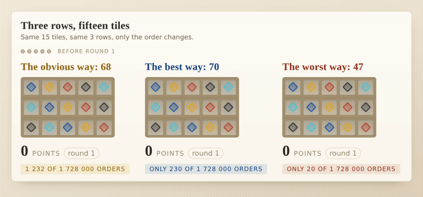

## Contents

- [The short version](#the-short-version)
- [How to read these boards](#how-to-read-these-boards)
- [One row: what does the order cost?](#one-row-what-does-the-order-cost)
- [Two rows: the columns start to matter](#two-rows-the-columns-start-to-matter)
- [Three rows: 47 to 70](#three-rows-47-to-70)
- [Why a tile can be worth seven](#why-a-tile-can-be-worth-seven)
- [Horizontal gaps are easy. Vertical ones are not.](#horizontal-gaps-are-easy-vertical-ones-are-not)
- [Holes above a tile need one round each](#holes-above-a-tile-need-one-round-each)
- [The first three tiles](#the-first-three-tiles)
- [Rows are not interchangeable](#rows-are-not-interchangeable)
- [Notes on the numbers](#notes-on-the-numbers)
- [The code](#the-code)

## The short version

Five rules, all of them measured rather than guessed. The rest of this page is
where each one comes from.

1. **Never leave a hole in a row you are filling.** On one row alone that is
   worth up to 4 points.
2. **A column grows downwards for free.** You can drop several tiles into the
   same column in the same round at no cost, as long as each one lands below the
   last, because the wall is filled from the top row down.
3. **A column grows upwards one tile per round.** Count the empty squares above
   each tile you have already placed. If there are more of them than there are
   rounds left, the difference is tiles that will score nothing vertically.
4. **Open with a small step near the middle.** One tile in each of your first
   rows, one column apart, away from the edges. No other opening keeps the
   maximum alive as often, and it beats the plain diagonal five to one.
5. **Keep your choices in the top rows.** The top rows are tiled first, so a row
   that runs out of good squares early costs more than one that runs out late.

## How to read these boards

The number on a tile is the round it was placed in. Rows, columns and rounds are
numbered 1 to 5.

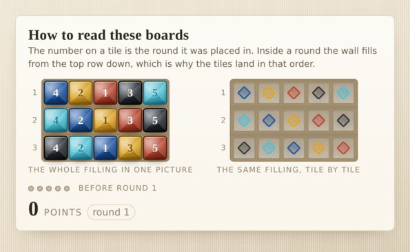

Inside a single round the wall is filled from the top row down. That is worth
remembering, because most of what follows is a consequence of it.

## One row: what does the order cost?

Five tiles, five rounds, one row. There are 120 orders and they score between 11
and 15 points.

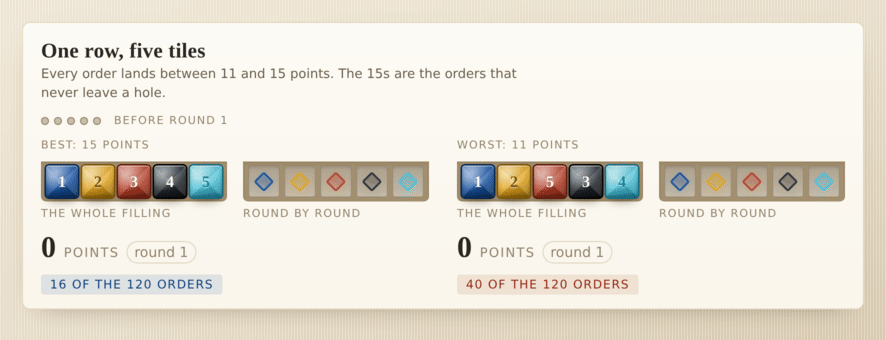

15 is what you get whenever the tiles already placed always form a single block,
so the row grows from one end or the other. There are 16 such orders out of 120,
one for every way of choosing left or right four times. 11 is the worst, and it
happens 40 times: every one of those orders breaks the row into two or three
separate blocks before joining them up. Four points, on a single row, decided by
nothing but order.

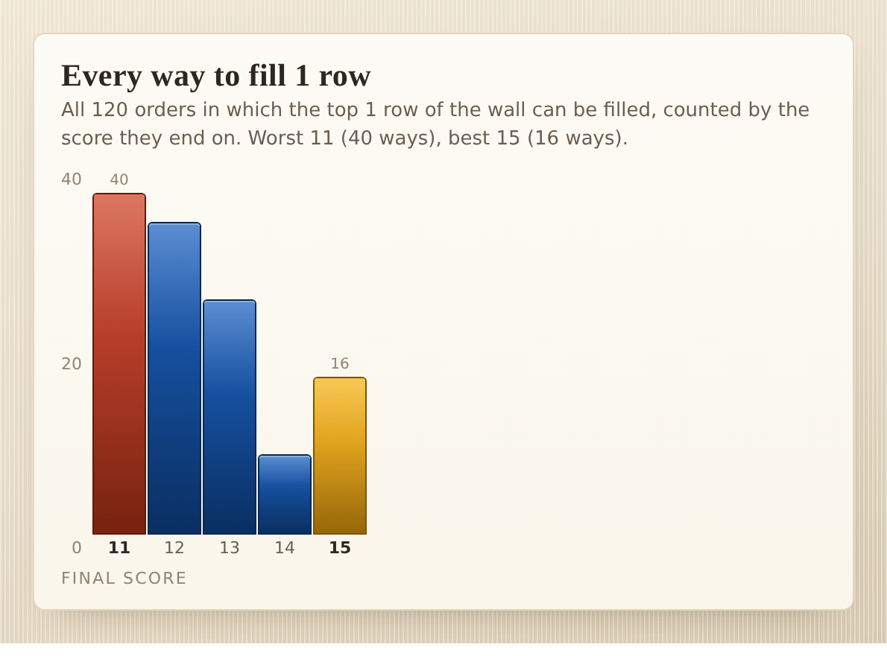

## Two rows: the columns start to matter

Ten tiles over the same five rounds. 14 400 orders, from 29 to 40 points.

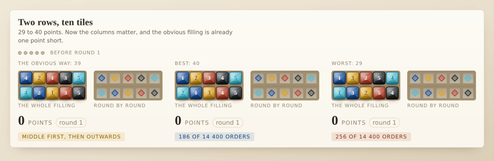

The obvious filling, middle first and then outwards on both rows, is worth 39. It
is already one point short of the maximum, and nothing about it looks wrong.

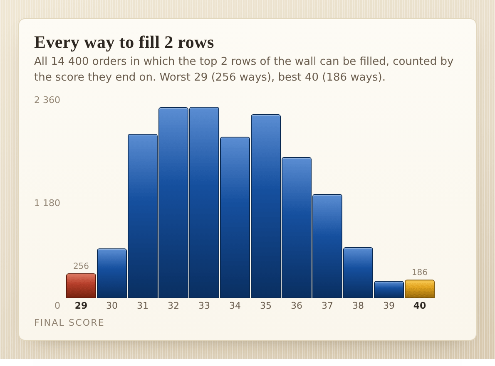

## Three rows: 47 to 70

15 tiles, 3 rows, 1 728 000 orders.

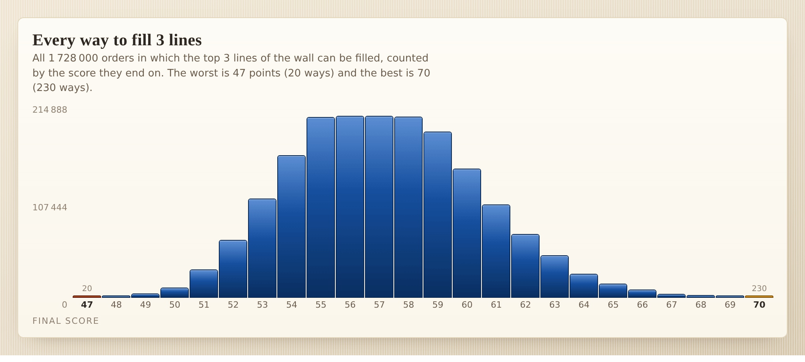

Only 230 of them reach 70 points, which is 0.013%. Only 20 end at 47. The obvious
filling, the symmetric one that looks like the cleanest thing you could possibly
do, scores 68. The animation at the top of this page is those three orders side
by side, and it is worth watching which one is ahead after round 3.

The way Azul's scoring works is weird and intuition is often wrong.

## Why a tile can be worth seven

A tile that has at least 1 vertical AND 1 horizontal adjacent tile counts twice.
Therefore the goal is to maximize the amount of "counts twice" without creating
gaps.

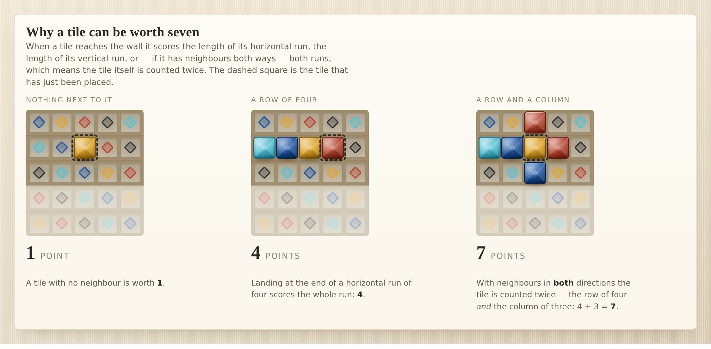

## Horizontal gaps are easy. Vertical ones are not.

Lateral (horizontal) gaps are easy to see, just put a tile to the left or to the
right of another tile in the current row.

Vertical gaps are a bit tricky to see. Almost the same rule, put a tile above or
below another tile in the current column, but with one catch, and the catch is
the most useful thing on this page.

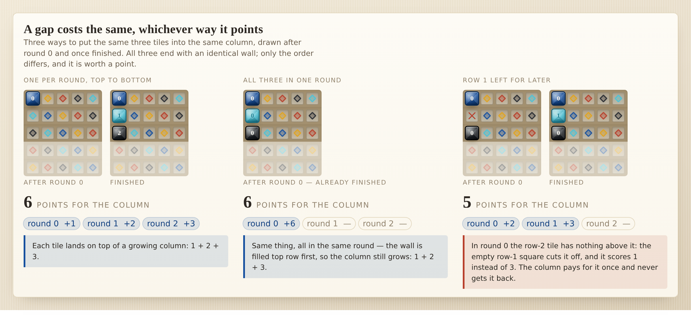

Filling all three squares of a column in a single round costs nothing, because
the wall is filled from the top row down and each tile already has the one above
it to lean on. Leaving row 2 for later costs a point, because in round 1 the
row-3 tile has nothing above it.

So a column is free to grow **downwards** and expensive to grow **upwards**.

## Holes above a tile need one round each

Once a tile is on the wall, the only way to extend its column upwards without
waste is one tile per round. A tile only counts a vertical neighbour that is
already there, and within a round the tiles above land first, so two tiles
stacked into the same column above an existing tile means the upper one lands on
top of an empty square and scores nothing vertically.

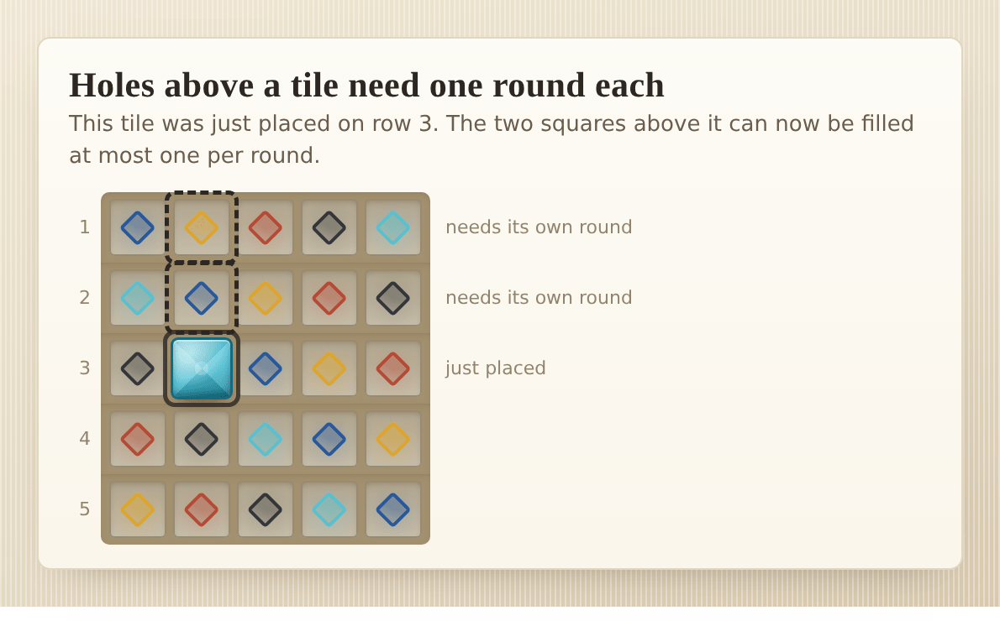

With **H** empty squares above a tile and **R** rounds left, at least **H minus
R** of the tiles you put there are wasted. Three holes and one round left is two
wasted tiles, and it has already happened whether you have noticed or not. This
is the one thing on this page you can count at the table.

## The first three tiles

We took the best and the worst scoring results for 3 lines, looked only at the
first 3 placed tiles and removed duplicates.

The [best starters](./results/3_lines_best_starters.txt):

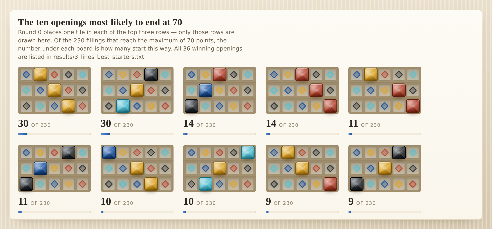

The [worst starters](./results/3_lines_worst_starters.txt):

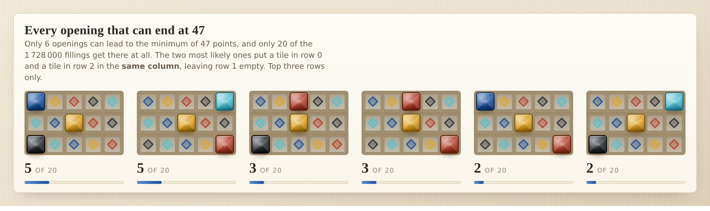

(Those two files, like everything in `results/`, count rounds from 0. The figures
renumber them.)

The two most likely routes to the worst possible score put a tile in row 1 and a
tile in row 3 of the **same column**, leaving row 2 empty. That is exactly the
vertical gap above, committed in the first round.

Note that the results are coherent as every configuration has its vertical
symetry and the sum of duplicates does match the total number of configurations
that reach the max/min score.

Two starters, that we'll call "the large steps", are present in the best starters
and in the worst starters. These two are the **only ones present in both sets**:

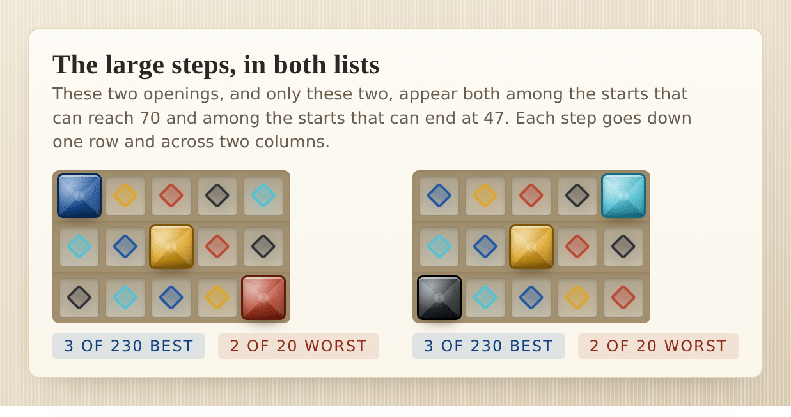

Looking at the strongest openings we have the "small steps", and the result is
intuitive:

- Central small steps are the best since for each row, there are 2 optimal tile
  placements available.
- Lateral small steps are roughly twice as hard to optimize because the third row
  only has 1 optimal placement for the next round.

But then, why is the plain diagonal worse than both?

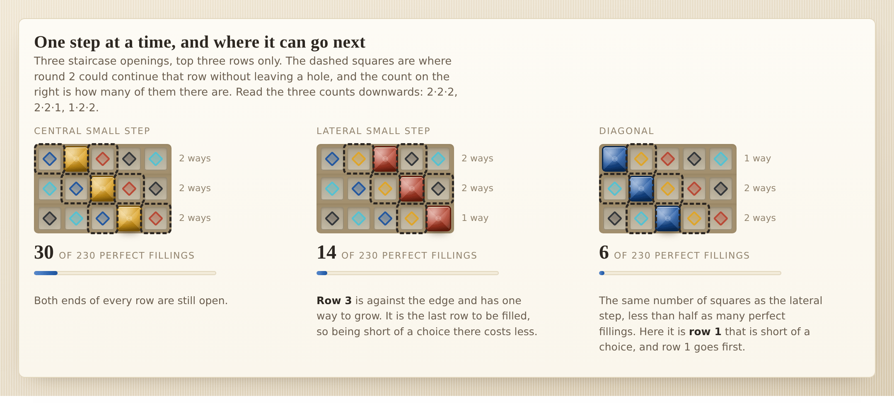

Count, for each row, how many squares that row's first tile can still grow into.
Read the three counts downwards and you have the answer: 2·2·2 keeps 30 of the
perfect fillings alive, 2·2·1 keeps 14, and 1·2·2 keeps only 6. The same number
of squares in total, less than half as many perfect fillings, because the row
that is short of a choice is row 1, and row 1 is tiled first.

## Rows are not interchangeable

**There is something important to understand here: there is an asymetry between
high rows and low rows.** This is due to the order of tiling, the top rows are
filled first and the bottom rows are filled after.

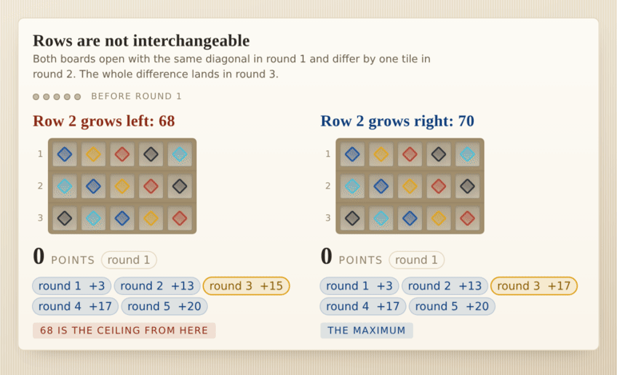

Both boards open with the same diagonal. They differ by a single tile in round 2,
and the entire difference lands in round 3: on the left, the row-1 tile of column
3 arrives before the row-2 tile below it and cannot count it, so it scores 3
instead of 6. Two points, and no way to get them back.

Of course, we're discussing small point variations, but it's interesting to
understand why it happens!

## Notes on the numbers

`python3 viz/checks.py` re-derives the published numbers independently and prints
what it finds. Three things it confirms:

**The flat top of the three-row histogram is real.** Recounting all 1 728 000
boards with a scorer written from scratch gives the same count for every bar as
the engine did. 56 points (214 888 orders) and 57 points (213 938 orders) are a
near tie, 0.44% apart, while their neighbours 55 and 58 are already 9% lower. The
distribution is skewed, not a bell: mode 56, mean 57.2, and 23 points of range.
It is a sum of five dependent per-round gains, so there is no reason for it to be
symmetric.

**The openings account for every extreme filling.** The best starters' duplicate
counts sum to exactly 230 and the worst to exactly 20, and every opening appears
together with its mirror image and the same count.

**The one-round-per-hole rule is exhaustive, not illustrative.** Every way of
distributing H holes over R rounds was enumerated. The best result always loses
exactly H minus R tiles.

## The code

This is a fork of [trajafri/Azul](https://github.com/trajafri/Azul). Their engine
plays the game and scores the wall; everything in this repository beyond
`src/adjacent.py` and `viz/` is theirs.

Brute-force the fillings and write the files in `results/`:

```
python3 src/adjacent.py lines 1        # 120 orders          (a second)
python3 src/adjacent.py lines 2        # 14 400 orders       (a few seconds)
python3 src/adjacent.py lines 3        # 1 728 000 orders    (~4 minutes)
python3 src/adjacent.py starters 3     # the openings, from the files above
python3 src/adjacent.py demo           # print a board or two, as a sanity check
```

In the results files a filling is written as one tuple per wall row, and the
number in column c is the round in which that column was filled, counting from 0.
The figures on this page renumber those to 1 to 5.

Draw the figures, and check the scoring behind them:

```
python3 viz/make_figures.py            # every figure and GIF, a few minutes
python3 viz/make_figures.py one_line   # just one
python3 viz/make_figures.py --list     # what there is
python3 viz/test_wall.py               # figure scoring vs the engine, board by board
python3 viz/checks.py                  # the three checks above
```

No picture on this page was drawn by hand and no number printed on one was typed
in. The tiles are the ones from
[ludometer](https://github.com/RemiFabre/ludometer), a full Azul implementation
with its own art: `viz/theme.css` is that project's palette, vendored unmodified,
and the figures are rendered in a headless browser.
[viz/README.md](viz/README.md) explains how it fits together and how to add a
figure.

To play the game in a terminal, run `python3 src/main.py`. Enter a factory
number (1 based, `m` for the middle), a tile number (0 to 4), and a line number
(0 to 4, out of range sends the tiles to the floor). So `1 4 1` moves the `4`
tiles from factory 1 to staging line 1.
