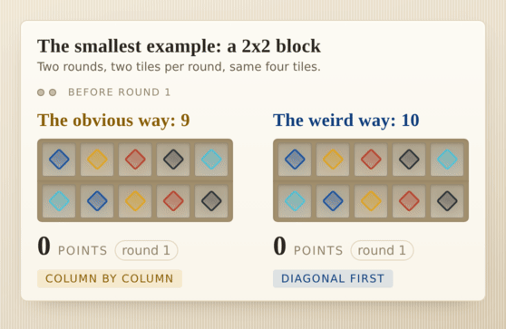
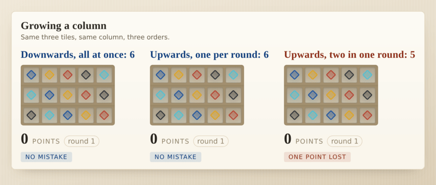
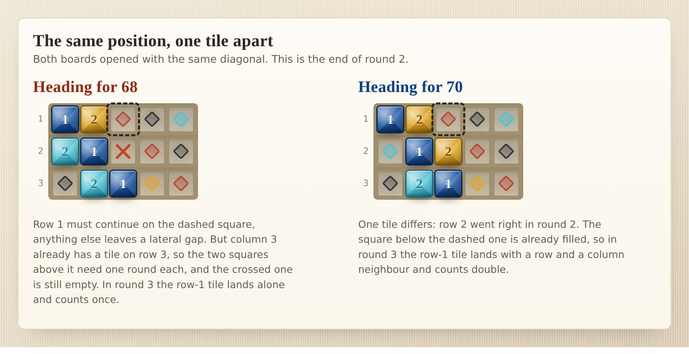

# Tiling order in Azul

**The same 15 tiles, in the same 3 rows of the wall, can score anywhere from 47 to 70 points. Only the order changes.**

This started as a way to check a few theories I had about Azul's scoring. I
brute-forced every order in which the top rows of a wall can be filled, all
1 728 000 of them, and the results were more interesting than the theories. If
you already play Azul well, there is something here for you.


## Contents

- [The rules learned from this study](#the-rules-learned-from-this-study)
- [How to read these boards](#how-to-read-these-boards)
- [The simplest case: one row](#the-simplest-case-one-row)
- [Two rows: the columns start to matter](#two-rows-the-columns-start-to-matter)
- [Three rows: 47 to 70](#three-rows-47-to-70)
- [Why weird tilings can score more than ordered ones](#why-weird-tilings-can-score-more-than-ordered-ones)
- [Horizontal gaps are easy. Vertical ones are not.](#horizontal-gaps-are-easy-vertical-ones-are-not)
- [Holes above a tile need one round each](#holes-above-a-tile-need-one-round-each)
- [The first three tiles](#the-first-three-tiles)
- [Rows are not interchangeable](#rows-are-not-interchangeable)
- [Notes on the numbers](#notes-on-the-numbers)
- [The code](#the-code)

## The rules learned from this study

1. **Never leave a hole in a row you are filling.** On one row alone that is
   worth up to 4 points.
2. **A column grows downwards for free.** You can drop several tiles into the
   same column in the same round at no cost.
3. **A column grows upwards one tile per round, maximum.** Any faster and some
   tiles will create a vertical hole.

These are rules for tiling optimally. In a real game, with opponents and
factories, following them blindly is not always the best move.

## How to read these boards

The number on a tile is the round it was placed in. Rows, columns and rounds are
numbered 1 to 5.


Remember that a wall is filled from the top row down.

## The simplest case: one row

Let's use this simplified case to understand what a good tiling is and how many
points a poor one loses. There are 120 ways to tile one row, and they score
between 11 and 15 points.


15 is what you get whenever the tiles already placed always form a single block,
so the row grows from one end or the other. 11 is what you get when the row
breaks into separate blocks that only join at the end.


## Two rows: the columns start to matter

Ten tiles over the same five rounds. 14 400 orders, from 29 to 40 points.


The obvious filling, middle first and then outwards on both rows, is worth 39.
This is already one point less than the optimal way. To me this was not
intuitive at all, and the next sections explain why it happens.


## Three rows: 47 to 70

15 tiles, 3 rows, 1 728 000 orders.


Only 230 of them reach 70 points, which is 0.013%. Only 20 end at 47. The
obvious filling, the symmetric one that looks like the cleanest thing you could
possibly do, scores 68.

## Why weird tilings can score more than ordered ones

Azul's scoring has one strange rule: a tile can count double. This happens every
time the tile you place has at least one vertical adjacent tile AND one
horizontal adjacent tile. When that is true, the tile counts twice, once in its
row and once in its column.

The smallest example is a 2x2 block built in two rounds:



The obvious filling, one column then the other, scores 3 then 6: 9 points. The
diagonal start scores only 2 in round 1, both tiles are alone. But in round 2
each new tile arrives with a row neighbour and a column neighbour, counts
double, and scores 4: 10 points.

This is the trick behind every non-intuitive result on this page. The best
tilings are the ones that score these double points as often as possible,
without creating gaps.

## Horizontal gaps are easy. Vertical ones are not.

Lateral (horizontal) gaps are easy to see, just put a tile to the left or to the
right of another tile in the current row.

Vertical gaps are trickier, and the reason is the fill order. Tiles are placed
from the top row down, so below an existing tile you can place as many tiles as
you want in a single round and lose nothing. Above an existing tile, you can
only place one per round.



## Holes above a tile need one round each


Every empty square above one of your tiles is a commitment: it will take a full
round to fill without waste. More holes above your tiles than rounds left means
points already lost.

## The first three tiles

Everything below is about filling the top three rows. It generalizes to all
five, but it's harder to visualize so we settled on 3 rows for this study.

We took the best and the worst scoring results for 3 lines, looked only at the
first 3 placed tiles and removed duplicates.

The [best starters](./results/3_lines_best_starters.txt):


The [worst starters](./results/3_lines_worst_starters.txt):


The two most likely routes to the worst possible score put a tile in row 1 and a
tile in row 3 of the **same column**, leaving row 2 empty. That is exactly the
vertical gap above, committed in the first round.

Note that the results are coherent as every configuration has its vertical
symmetry and the sum of duplicates does match the total number of configurations
that reach the max/min score.

Two starters, that we'll call "the large steps", are present in the best starters
and in the worst starters. These two are the **only ones present in both sets**:


Looking at the strongest openings we have the "small steps", and the result is
intuitive:

- Central small steps are the best since for each row, there are 2 optimal tile
  placements available.
- Lateral small steps are roughly twice as hard to optimize because the third row
  only has 1 optimal placement for the next round.

But then, why is the plain diagonal worse than both?


The answer is not the edge. It is a forced vertical gap, and it deserves its own
section.

## Rows are not interchangeable

**There is something important to understand here: there is an asymmetry between
high rows and low rows.** This is due to the order of tiling, the top rows are
filled first and the bottom rows are filled after.

Both boards below open with the same diagonal and differ by a single tile in
round 2. Here they are at the end of round 2:



On the left board, the only way to continue row 1 without a lateral gap is the
dashed square of column 3. But column 3 already has a tile on row 3, and the two
squares above it can only be filled one per round. The square below is still
empty, so in round 3 the row-1 tile lands alone, counts once, and 68 is the best
this board can reach.


Of course, we're discussing small point variations, but it's interesting to
understand why it happens!

## Notes on the numbers

`python3 viz/checks.py` re-derives the published numbers independently and prints
what it finds. Three things it confirms:

**The flat top of the three-row histogram is real.** Recounting all 1 728 000
boards with a scorer written from scratch gives the same count for every bar as
the engine did. 56 points (214 888 orders) and 57 points (213 938 orders) are a
near tie, 0.44% apart, while their neighbours 55 and 58 are already 9% lower. The
distribution is skewed, not a bell: mode 56, mean 57.2, and 23 points of range.
It is a sum of five dependent per-round gains, so there is no reason for it to be
symmetric.

**The openings account for every extreme filling.** The best starters' duplicate
counts sum to exactly 230 and the worst to exactly 20, and every opening appears
together with its mirror image and the same count.

**The one-round-per-hole rule is exhaustive, not illustrative.** Every way of
distributing the holes above a tile over the remaining rounds was enumerated, and
the count of wasted tiles is always the number of holes minus the number of
rounds.

## The code

This is a fork of [trajafri/Azul](https://github.com/trajafri/Azul). Their engine
plays the game and scores the wall; everything in this repository beyond
`src/adjacent.py` and `viz/` is theirs.

Brute-force the fillings and write the files in `results/`:

```
python3 src/adjacent.py lines 1        # 120 orders          (a second)
python3 src/adjacent.py lines 2        # 14 400 orders       (a few seconds)
python3 src/adjacent.py lines 3        # 1 728 000 orders    (~4 minutes)
python3 src/adjacent.py starters 3     # the openings, from the files above
python3 src/adjacent.py demo           # print a board or two, as a sanity check
```

In the results files a filling is written as one tuple per wall row, and the
number in column c is the round in which that column was filled, counting from 0.
The figures on this page renumber those to 1 to 5.

Draw the figures, and check the scoring behind them:

```
python3 viz/make_figures.py            # every figure and GIF, a few minutes
python3 viz/make_figures.py one_line   # just one
python3 viz/make_figures.py --list     # what there is
python3 viz/test_wall.py               # figure scoring vs the engine, board by board
python3 viz/checks.py                  # the three checks above
```

No picture on this page was drawn by hand and no number printed on one was typed
in. The tiles are the ones from
[ludometer](https://github.com/RemiFabre/ludometer), a full Azul implementation
with its own art: `viz/theme.css` is that project's palette, vendored unmodified,
and the figures are rendered in a headless browser.
[viz/README.md](viz/README.md) explains how it fits together and how to add a
figure.

To play the game in a terminal, run `python3 src/main.py`. Enter a factory
number (1 based, `m` for the middle), a tile number (0 to 4), and a line number
(0 to 4, out of range sends the tiles to the floor). So `1 4 1` moves the `4`
tiles from factory 1 to staging line 1.
