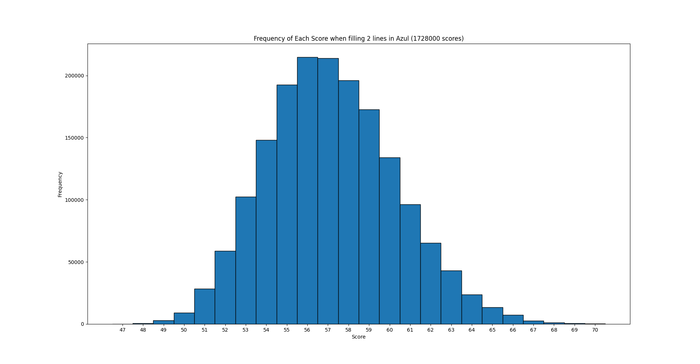

# Azul statistics
This is a fork from [here](https://github.com/trajafri/Azul).
The goal of this repository is only to use their engine to calculate tile scores and brute force combinations to draw statistics.

# Usage
The only file coded by me is adjacent.py

To visualize a board one can use:
```
print(boards_to_str([board]))
```

# Results





All the recorded results can be found in /results.

When reading a tiling history, the numbers indicate the round when the tile was set e.g:
```
(0, 1, 2, 3, 4)
(2, 0, 1, 3, 4)
```
=> In the first round, the tiles "0" were set, for 2 points. In the second round, the tiles "1" were set, for 6 extra points. 


Below is the README from the main repository:

# Analysis

The way Azul's scoring works is weird and intuition is often wrong.
For example, one might think that this is the best possible way of filling the 3 first rows:
```
(0, 1, 2, 3, 4)
(0, 1, 2, 3, 4)
(0, 1, 2, 3, 4)
```
But it isn't, this will net an excellent score of 68 points, but the maximum possible score is 70 points. **For example, this one gives 70 points:** 
```
(0, 1, 2, 3, 4)
(3, 2, 1, 0, 4)
(3, 2, 0, 1, 4)
```

What about this one?
```
(0, 2, 1, 4, 3)
(1, 2, 0, 4, 3)
(0, 1, 4, 3, 2)
```
-> Well, this is an example of the **worst possible score with 3 lines: 47 points.**

The reason is that in Azul, a tile that has at least 1 vertical AND 1 horizontal adjacent tile, counts twice. Therefore the goal is to maximize the amount of "counts twice" without creating gaps.

Lateral (horizontal) gaps are easy to see, just put a tile to the left or to the right of another tile in the current row.

Vertical gaps are a bit tricky to see, but really it's the same rule. Just put a tile above or below another tile in the current column.
So this is fine:
```
(0)
(1)
(2)
```
This is also fine:
```
(0)
(0)
(0)
```

But this is not fine, since the tile in the row 3 created a vertical gap with row 1:
```
(0)
(1)
(0)
```


# Azul

This repository contains a simple implementation of the Azul board game, implemented in Python.

This implementation is a port of a [Racket](https://racket-lang.org/) implementation of Azul written
for a school project.

Note that:

* This implementation lacks documentation. If needed, they can be requested by an issue (or PR :} )
* Python used in this project is a bit awkward. This is due to direct translation of the original implementation.
* If you don't like anything about the interface, it should be trivial to change that (hopefully)
* Although this is a port, it is very likely I have messed up the translation somewhere. If you happen to find out, feel free to open an issue
  (and sorry if a bug causes issues :( ).

## Playing

Simply run `main.py` to play the game. Then, follow the instructions below to play.

## How To


Initially, a player is selected randomly. To make a move, enter the following:
* Factory Number: This is 1 based. To access the middle factory, simply type `m`. The program should handle errors when the factory number is incorrect (oob or if the factory chosen is empty).
* Tile Number: This is a number between 0-4 (these are the tiles seen on in the factories).
* Line Number: A number between 0-4. An out of bound line number will move the tiles to the overflow region.

An example input is as follows:
`1 4 1`

The above input will move the `4` tiles from `f-1` to staging line `1` of player 1.
